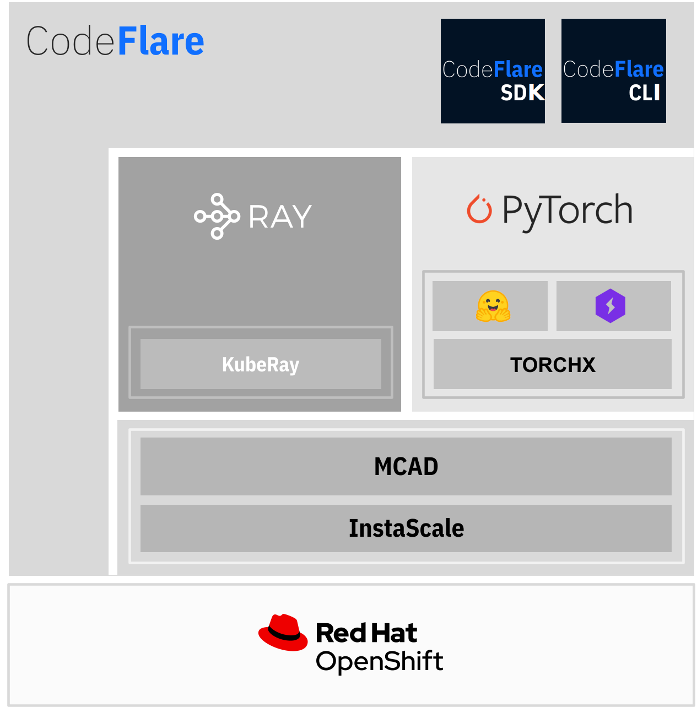

<!--

Copyright 2021, 2022, 2023 IBM

Licensed under the Apache License, Version 2.0 (the "License");
you may not use this file except in compliance with the License.
You may obtain a copy of the License at

http://www.apache.org/licenses/LICENSE-2.0

Unless required by applicable law or agreed to in writing, software
distributed under the License is distributed on an "AS IS" BASIS,
WITHOUT WARRANTIES OR CONDITIONS OF ANY KIND, either express or implied.
See the License for the specific language governing permissions and
limitations under the License.

-->

<!--

 
-->

 

<!-- >> **⚠ UPDATE**  
> CodeFlare is evolving! Check our [updates](https://github.com/project-codeflare/codeflare#pipeline-execution-and-scaling) for CodeFlare Pipelines and related contributions to Ray Workflows under Ray project. -->

# Simplified and efficient AI/ML on the hybrid cloud

CodeFlare provides a simple, user-friendly abstraction for developing, scaling, and managing resources for distributed AI/ML on the Hybrid Cloud platform with OpenShift Container Platform.

---

## 📦 Stack Components and Features

CodeFlare stack consists of the following main components. This project is organized as a metarepo, gathering pointers and artifacts to deploy and use the stack.

* **Simplified user experience**:
CodeFlare [SDK](https://github.com/project-codeflare/codeflare-sdk) and [CLI](https://github.com/project-codeflare/codeflare-cli) to define, develop, and control remote distributed compute jobs and infrastructure from either a python-based environment or command-line interface

* **Efficient resource management**:
Multi-Cluster Application Dispatcher [(MCAD)](https://github.com/project-codeflare/multi-cluster-app-dispatcher) for queueing, resource quotas, and management of batch jobs. And [Instascale](https://github.com/project-codeflare/instascale) for on-demand resource scaling of an OpenShift cluster

* **Automated and streamlined deployment**:
[CodeFlare Operator](https://github.com/project-codeflare/codeflare-operator) for automating deployment and configuration of the Project CodeFlare stack

With CodeFlare stack, users automate and simplify the execution and scaling of the steps in the life cycle of model development, from data pre-processing, distributed model training, model adaptation and validation.

Through transparent integration with [Ray](https://github.com/ray-project/ray) and [PyTorch](https://github.com/pytorch/pytorch) frameworks, and the rich library ecosystem that run on them, CodeFlare enables data scientists to **spend more time on model development and minimum time on resource deployment and scaling**. 

See below our stack and how to get started.

--- 
## ⚙️ Project CodeFlare Ecosystem

In addition to running standalone, Project CodeFlare is deployed as part of and integrated with the [Open Data Hub](https://github.com/opendatahub-io/distributed-workloads), leveraging [OpenShift Container Platform](https://www.openshift.com). 

With OpenShift, CodeFlare can be deployed anywhere, from on-prem to cloud, and integrate easily with other cloud-native ecosystems.

---

## 🛠️ Getting Started

### Learning

Watch [this video](https://www.youtube.com/watch?v=OAzFBFL5B0k) for an introduction to Project CodeFlare and what the
stack can do.

### Quick Start

To get started using the Project CodeFlare stack, try this [end-to-end example](https://github.com/opendatahub-io/distributed-workloads/blob/main/Quick-Start.md)!

For more basic walk-throughs and in-depth tutorials, see our [demo notebooks](https://github.com/project-codeflare/codeflare-sdk/tree/main/demo-notebooks/guided-demos)!

## Development

See more details in any of the component repos linked above, or get started by taking a look at the [project board](https://github.com/orgs/project-codeflare/projects/8) for open tasks/issues!

### Architecture

We attempt to document all architectural decisions in our [ADR documents](https://github.com/project-codeflare/adr). Start here to understand the architectural details of Project CodeFlare.

---

## 🎉 Getting Involved and Contributing

Join our [Slack community][slack] to get involved or ask questions.

## Blog

CodeFlare related blogs are published on our [Medium publication](https://medium.com/codeflare).

## License

CodeFlare is an open-source project with an [Apache 2.0 license](LICENSE).

[codeflare-sdk]: https://github.com/project-codeflare/codeflare-sdk
[codeflare-cli]: https://github.com/project-codeflare/codeflare-cli
[mcad]: https://github.com/project-codeflare/multi-cluster-app-dispatcher
[instascale]: https://github.com/project-codeflare/instascale
[codeflare-operator]: https://github.com/project-codeflare/codeflare-operator
[distributed-workloads]: https://github.com/opendatahub-io/distributed-workloads
[quickstart]: https://github.com/opendatahub-io/distributed-workloads/blob/main/Quick-Start.md
[slack]: https://invite.playplay.io/invite?team_id=T04KQQBTDN3
[adr]: https://github.com/project-codeflare/adr
[demos]: https://github.com/project-codeflare/codeflare-sdk/tree/main/demo-notebooks/guided-demos
[board]: https://github.com/orgs/project-codeflare/projects/8
[youtube-demo]: https://www.youtube.com/watch?v=OAzFBFL5B0k
