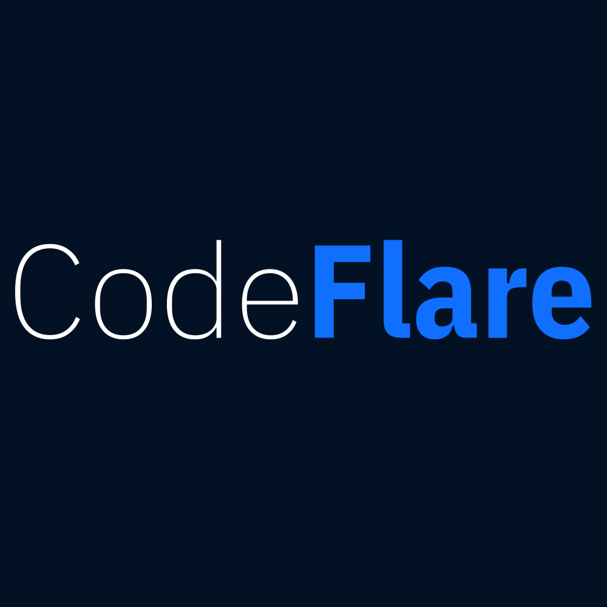
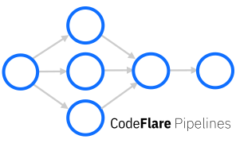
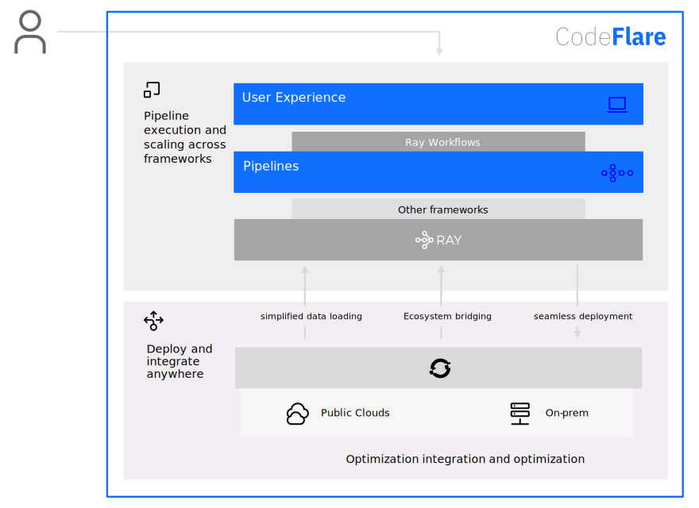

<!--

Copyright 2021 IBM

Licensed under the Apache License, Version 2.0 (the "License");
you may not use this file except in compliance with the License.
You may obtain a copy of the License at

http://www.apache.org/licenses/LICENSE-2.0

Unless required by applicable law or agreed to in writing, software
distributed under the License is distributed on an "AS IS" BASIS,
WITHOUT WARRANTIES OR CONDITIONS OF ANY KIND, either express or implied.
See the License for the specific language governing permissions and
limitations under the License.

-->

<p align="center">

</p>

<!--
<p align="center">

</p> 
-->

[](http://www.apache.org/licenses/LICENSE-2.0)
[](https://travis-ci.com/project-codeflare/codeflare.svg?branch=main) 
[](https://badge.fury.io/py/codeflare)
[](https://codeflare.readthedocs.io/en/latest/?badge=latest)
[](https://github.com/project-codeflare/codeflare/issues)


# Scale complex AI/ML pipelines anywhere

CodeFlare is a framework to simplify the integration, scaling and acceleration of complex multi-step analytics and machine learning pipelines on the cloud.

Its main features are: 

* **Pipeline execution and scaling**:
CodeFlare Pipelines facilities the definition and parallel execution of pipelines. It unifies pipeline workflows across multiple frameworks while providing nearly optimal scale-out parallelism on pipelined computations.
<!--CodeFlare Pipelines facilities the definition and parallel execution of pipelines. It unifies pipeline workflows across multiple platforms such as [scikit-learn](https://scikit-learn.org/) and [Apache Spark](https://spark.apache.org/), while providing nearly optimal scale-out parallelism on pipelined computations.-->

* **Deploy and integrate anywhere**: 
CodeFlare simplifies deployment and integration by enabling a serverless user experience with the integration with Red Hat OpenShift and IBM Cloud Code Engine and integrating adapters and connectors to make it simple to load data and connect to data services.

<p align="center">

</p>

## Release status

This project is under active development. See the [Documentation](https://codeflare.readthedocs.io/en/latest/index.html) for design descriptions and the latest version of the APIs. 

## Quick start

### Run in your laptop

#### Instaling locally

CodeFlare can be installed from PyPI.

Prerequisites:
* [Python 3.8+](https://www.python.org/downloads/)
* [JupyterLab](https://jupyter.org) *(to run examples)*

We recommend installing Python 3.8.6 using
[pyenv](https://github.com/pyenv/pyenv). You can find [here](https://codeflare.readthedocs.io/en/latest/getting_started/setting_python_env.html) recommended steps to set up the Python environment.


Install from PyPI:
```bash
pip3 install --upgrade pip          # CodeFlare requires pip >21.0
pip3 install --upgrade codeflare
```

Alternatively, you can also build locally with:
```shell
git clone https://github.com/project-codeflare/codeflare.git
pip3 install --upgrade pip
pip3 install .
```

#### Using Docker

You can try CodeFlare by running the docker image from [Docker Hub](https://hub.docker.com/r/projectcodeflare/codeflare/tags):
- `projectcodeflare/codeflare:latest` has the latest released version installed.

The command below starts the most recent development build in a clean environment:

```
docker run -it -p 8888:8888 projectcodeflare/codeflare:latest jupyter-lab --debug
```

It should produce an output similar to the one below, where you can then find the URL to run CodeFlare from a Jupyter notebook in your local browser.

```
    To access the notebook, open this file in a browser:
 ...
    Or copy and paste one of these URLs:
        http://<token>:8888/?token=<token>
     or http://127.0.0.1:8888/?token=<token>
```

#### Using Binder service

You can try out some of CodeFlare features using the My Binder service.

Click on the link below to try CodeFlare, on a sandbox environment, without having to install anything.

[](https://mybinder.org/v2/gh/project-codeflare/codeflare.git/develop)


## Pipeline execution and scaling

<p align="center">

</p>

## CodeFlare Pipelines

CodeFlare Pipelines reimagined pipelines to provide a more intuitive API for the data scientist to create AI/ML pipelines, data workflows, pre-processing, post-processing tasks, and many more which can scale from a laptop to a cluster seamlessly.

See the API documentation [here](https://codeflare.readthedocs.io/en/latest/codeflare.pipelines.html), and reference use case documentation in the Examples section.

Examples are provided as executable [notebooks](https://github.com/project-codeflare/codeflare/tree/main/notebooks). 

To run examples, if you haven't done so yet, clone the CodeFlare project with:

```bash
git clone https://github.com/project-codeflare/codeflare.git
```

Example notebooks require JupyterLab, which can be installed with:
```bash
pip3 install --upgrade jupyterlab
```

Use the command below to run locally:
```shell
jupyter-lab codeflare/notebooks/<example_notebook>
```

The step above should automatically open a browser window and connect to a running Jupyter server.

If you are using any one of the recommended cloud based deployments, examples are found in the `codeflare/notebooks` directory in the container image. The examples can be executed directly from the Jupyter environment. 

As a first example, we recommend the [sample pipeline](https://github.com/project-codeflare/codeflare/blob/main/notebooks/sample_pipeline.ipynb).

## Deploy and integrate anywhere

Unleash the power of pipelines by seamlessly scaling on the cloud. CodeFlare can be deployed on any Kubernetes-based platform, including [IBM Cloud Code Engine](https://www.ibm.com/cloud/code-engine) and [Red Hat OpenShift Container Platform](https://www.openshift.com). 

- [IBM Cloud Code Engine](./deploy/ibm_cloud_code_engine) for detailed instructions on how to run CodeFlare on a serverless platform.
- [Red Hat OpenShift](./deploy/redhat_openshift) for detailed instructions on how to run CodeFlare on OpenShift Container Platform.

## Contributing

Join us in making CodeFlare Better! We encourage you to take a look at our [Contributing](CONTRIBUTING.md) page.

## Blog

CodeFlare related blogs are published on our [Medium publication](https://medium.com/codeflare)
