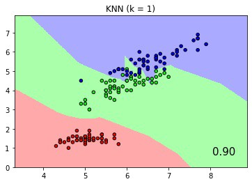

<!--

Copyright 2021 IBM

Licensed under the Apache License, Version 2.0 (the "License");
you may not use this file except in compliance with the License.
You may obtain a copy of the License at

http://www.apache.org/licenses/LICENSE-2.0

Unless required by applicable law or agreed to in writing, software
distributed under the License is distributed on an "AS IS" BASIS,
WITHOUT WARRANTIES OR CONDITIONS OF ANY KIND, either express or implied.
See the License for the specific language governing permissions and
limitations under the License.

-->

### Fit and score multiple classifiers with CodeFlare Pipeline

We use a sklearn pipeline example Comparing Nearest Neighbors with and without Neighborhood Components Analysis to demonstrate how to define, fit and score multiple classifiers with CodeFlare (CF) Pipelines. The sklearn and CF pipeline notebook is published here [here](https://github.com/project-codeflare/codeflare/blob/main/notebooks/plot_nca_classification.ipynb)
This example plots the class decision boundaries given by a Nearest Neighbors classifier when using the Euclidean distance on the original features, versus using the Euclidean distance after the transformation learned by Neighborhood Components Analysis. Its output is pictorially illustrated with colored decision boundaries like the pictures below.

This example plots the class decision boundaries given by a Nearest Neighbors classifier when using the Euclidean distance on the original features, versus using the Euclidean distance after the transformation learned by Neighborhood Components Analysis. Its output is pictorially illustrated with colored decision boundaries like the pictures below.



Classification score and boundaries of KNN with k=1


Classification score and boundaries of KNN with Neighborhood Component Analysis

In the original sklearn pipeline definition, the two KNN classifiers, with and without NCA, are defined with a list of two Pipeline objects as follows:

```python
classifiers = [Pipeline([('scaler', StandardScaler()),
                         ('knn', KNeighborsClassifier(n_neighbors=n_neighbors))
                         ]),
               Pipeline([('scaler', StandardScaler()),
                         ('nca', NeighborhoodComponentsAnalysis()),
                         ('knn', KNeighborsClassifier(n_neighbors=n_neighbors))
                         ])
               ]
```

Recognizing both Pipelines start with StandardScalar, we can express it with the same EstimatorNode in a CF pipeline to save redundant calculation, as follows:

```python
pipeline = dm.Pipeline()
node_scalar = dm.EstimatorNode('scaler', StandardScaler())
node_knn = dm.EstimatorNode('knn', KNeighborsClassifier(n_neighbors=n_neighbors))
node_nca = dm.EstimatorNode('nca', NeighborhoodComponentsAnalysis())
node_knn_post_nca = dm.EstimatorNode('knn_post_nca', KNeighborsClassifier(n_neighbors=n_neighbors))
```

In the above CF pipeline, four EstimatorNodes are initiated to define a StandardScalar, an NCA and two instances of KNN classifiers. The EstimatorNodes host respective transformers and models with data input and output ports connected by edges. As shown below, the add_edge() method with binary input connects EstimatorNodes in the upstream-to-downstream order.

```python
pipeline.add_edge(node_scalar, node_knn)
pipeline.add_edge(node_scalar, node_nca)
pipeline.add_edge(node_nca, node_knn_post_nca)
```

A pipeline's input data is constructed by creating the PipelineInput object. The add_xy_arg() method specifies the input node of the CF pipeline where training data and labels X_train and y_train are added. CF runtime rt executes the pipeline with the declared pipeline, ExecutionType and PipelineInput as input arguments. In our two-branch pipeline example, ExecutionType.FIT fits both pipelines in a single invocation.

```python
train_input = dm.PipelineInput()
train_input.add_xy_arg(node_scalar, dm.Xy(X_train, y_train))
pipeline_fitted = rt.execute_pipeline(pipeline, ExecutionType.FIT, train_input)
```

To get classification scores and prediction output, we first use the select_pipeline() method to identify a fitted pipeline by its end EstimatorNode. For example, the first KNN classifier without NCA is declared by node_knn. select_pipeline() returns the branch ending at node_knn. Subsequently, we use the execute_pipeline() method to invoke the scoring method by specifying ExecutionType.SCORE. Similarly, prediction output is returned via ExecutionType.PREDICT.

```python
knn_pipeline = rt.select_pipeline(pipeline_fitted, pipeline_fitted.get_xyrefs(node_knn)[0])
knn_score = ray.get(rt.execute_pipeline(knn_pipeline, ExecutionType.SCORE, test_input).get_xyrefs(node_knn)[0].get_Xref())
Z = ray.get(rt.execute_pipeline(knn_pipeline, ExecutionType.PREDICT, predict_input).get_xyrefs(node_knn)[0].get_Xref())
```

The same steps apply to get the score and predictions of the branch ending at node_knn_post_nca as shown below.

```python
nca_pipeline = rt.select_pipeline(pipeline_fitted, pipeline_fitted.get_xyrefs(node_knn_post_nca)[0])
nca_score = ray.get(rt.execute_pipeline(nca_pipeline, ExecutionType.SCORE, test_input).get_xyrefs(node_knn_post_nca)[0].get_Xref())

Z = ray.get(rt.execute_pipeline(nca_pipeline, ExecutionType.PREDICT, predict_input).get_xyrefs(node_knn_post_nca)[0].get_Xref())
```

Lastly, the fitted, scored and predicted results of the CF pipeline fully replicated those of the original sklearn pipeline, with the same plots shown below.


Classification score and boundaries of KNN with k=1


Classification score and boundaries of KNN with Neighborhood Component Analysis

The Jupyter notebook of this example is available [here](https://github.com/project-codeflare/codeflare/blob/main/notebooks/plot_nca_classification.ipynb) to demonstrate how one might translate sklearn pipelines to Codeflare pipelines that take advantage of Ray's distributed processing. Please try it out and let us know what you think.