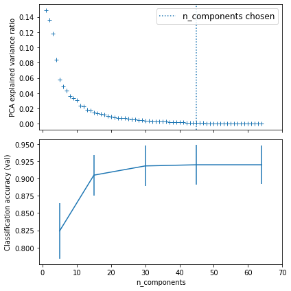
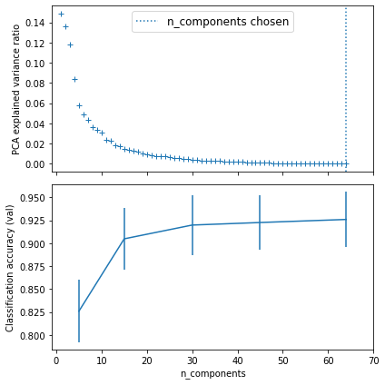

<!--

Copyright 2021 IBM

Licensed under the Apache License, Version 2.0 (the "License");
you may not use this file except in compliance with the License.
You may obtain a copy of the License at

http://www.apache.org/licenses/LICENSE-2.0

Unless required by applicable law or agreed to in writing, software
distributed under the License is distributed on an "AS IS" BASIS,
WITHOUT WARRANTIES OR CONDITIONS OF ANY KIND, either express or implied.
See the License for the specific language governing permissions and
limitations under the License.

-->

### Tuning hyper-parameters with CodeFlare Pipelines

`GridSearchCV()` is often used for hyper-parameter turning for a model constructed via sklearn pipelines. It does an exhaustive search over specified parameter values for a pipeline. It implements a `fit()` method and a `score()` method. The parameters of the pipeline used to apply these methods are optimized by cross-validated grid-search over a parameter grid.
Here we show how to convert an example of using `GridSearchCV()` to tune the hyper-parameters of an sklearn pipeline into one that uses Codeflare (CF) pipelines `grid_search_cv()`. We use the [Pipelining: chaining a PCA and a logistic regression](https://scikit-learn.org/stable/auto_examples/compose/plot_digits_pipe.html#sphx-glr-auto-examples-compose-plot-digits-pipe-py) from sklearn pipelines as an example. 

In this sklearn example, a pipeline is chained together with a PCA and a LogisticRegression. The `n_components` parameter of the PCA and the `C` parameter of the LogisticRegression are defined in a `param_grid`: with `n_components` in `[5, 15, 30, 45, 64]` and `C` defined by `np.logspace(-4, 4, 4)`. A total of 20 combinations of `n_components` and `C` parameter values will be explored by `GridSearchCV()` to find the best one with the highest `mean_test_score`.

```python
pca = PCA()
logistic = LogisticRegression(max_iter=10000, tol=0.1)
pipe = Pipeline(steps=[('pca', pca), ('logistic', logistic)])

X_digits, y_digits = datasets.load_digits(return_X_y=True)

param_grid = {
    'pca__n_components': [5, 15, 30, 45, 64],
    'logistic__C': np.logspace(-4, 4, 4),
}
search = GridSearchCV(pipe, param_grid, n_jobs=-1)
search.fit(X_digits, y_digits)
print("Best parameter (CV score=%0.3f):" % search.best_score_)
print(search.best_params_)
```

After running `GridSearchCV().fit()`, the best parameters of `PCA__n_components` and `LogisticRegression__C`, together with the cross-validated `mean_test scores` are printed out as follows. In this example, the best `n_components` chosen is 45 for the PCA.

```python
Best parameter (CV score=0.920):
{'logistic__C': 0.046415888336127774, 'pca__n_components': 45}
```

The PCA explained variance ratio and the best `n_components` chosen are plotted in the top chart. The classification accuracy and its `std_test_score` are plotted in the bottom chart. The best `n_components` can be obtained by calling `best_estimator_.named_step['pca'].n_components` from the returned object of `GridSearchCV()`.



### Converting to CodeFalre Pipelines with *grid search*


We next describe the step-by-step conversion of this example to one that uses CodeFlare Pipelines.

#### **Step 1: importing codeflare.pipelines packages and ray**

We need to first import various `codeflare.pipelines` packages, including `Datamodel` and `runtime`, as well as `ray` and call `ray.shutdwon()` and `ray.init()`. Note that, in order to run this CodeFlare example notebook, you need to have a running ray instance.

```python
import codeflare.pipelines.Datamodel as dm
import codeflare.pipelines.Runtime as rt
from codeflare.pipelines.Datamodel import Xy
from codeflare.pipelines.Datamodel import XYRef
from codeflare.pipelines.Runtime import ExecutionType
import ray
ray.shutdown()
ray.init()
```

#### **Step 2: defining and setting up a codeflare pipeline**

A codeflare pipeline is defined by `EstimatorNodes` and `edges` connecting two `EstimatorNodes`. In this case, we define `node_pca` and `node_logistic` and we connect these two nodes with `pipeline.add_edge()`. Before we can execute `fit()` on a pipeline, we need to set up the proper input to the pipeline.

```python
pca = PCA()
# set the tolerance to a large value to make the example faster
logistic = LogisticRegression(max_iter=10000, tol=0.1)
pipeline = dm.Pipeline()
node_pca = dm.EstimatorNode('pca', pca)
node_logistic = dm.EstimatorNode('logistic', logistic)
pipeline.add_edge(node_pca, node_logistic)
# input to pipeline
pipeline_input = dm.PipelineInput()
pipeline_input.add_xy_arg(node_pca, dm.Xy(X_digits, y_digits))
```

#### **Step 3: defining pipeline param grid and executing Codeflare pipelines `grid_search_cv()`** 

Codeflare pipelines runtime converts an sklearn param_grid into a codeflare pipelines param grid. We also specify the default `KFold` parameter for running the cross-validation. Finally, Codeflare pipelines runtime executes the `grid_search_cv()`.

```python
# param_grid
param_grid = {
        'pca__n_components': [5, 15, 30, 45, 64],
        'logistic__C': np.logspace(-4, 4, 4),
    }

pipeline_param = dm.PipelineParam.from_param_grid(param_grid)

# default KFold for grid search
k = 5
kf = KFold(k)

# execute CF pipeplie grid_search_cv
result = rt.grid_search_cv(kf, pipeline, pipeline_input, pipeline_param)
```

#### **Step 4: parsing the returned result from `grid_search_cv()`** 

As the Codeflare pipelines project is still actively under development, APIs to access some attributes of the explored pipelines in the `grid_search_cv()` are not yet available. As a result, a slightly more verbose code is used to get the best pipeline, its associated parameter values and other statistics from the returned object of `grid_search_cv()`. For example, we need to loop through all the 20 explored pipelines to get the best pipeline. And, to get the `n_component` of an explored pipeline, we first use `.get_nodes()` on the returned cross-validated pipeline and then use `.get_estimator()` and then finally use `.get_params()`.

```python
import statistics

# pick the best mean' and best pipeline
best_pipeline = None
best_mean_scores = 0.0
best_n_components = 0

df = pd.DataFrame(columns =('n_components', 'mean_test_score', 'std_test_score'))

for cv_pipeline, scores in result.items():
    mean = statistics.mean(scores)
    std = statistics.stdev(scores)
    n_components = 0
    params = {}
    # get the 'n_components' value of the PCA in this cv_pipeline
    for node_name, node in cv_pipeline.get_nodes().items():
        params[node_name] = node.get_estimator().get_params()
        if 'n_components' in params[node_name]:
            n_components = params[node_name]['n_components']
    assert(n_components > 0)
    df = df.append({'n_components' : n_components, 'mean_test_score' : mean, 'std_test_score' : std}, ignore_index=True)
    if mean > 0.92:
        print(mean)
        print(str(params))
        
    if mean > best_mean_scores:
        best_pipeline = cv_pipeline
        best_mean_scores = mean
        best_n_components = n_components
```

Due to the differences in split, the CodeFlare pipelines `grid_search_cv()` produces the best pipeline with `n_components = 64` for the PAC, and the 2nd best with `n_components = 45`. We print out the parameters of the 2nd best and the best pipelines as follows.

```python
0.9226679046734757
{'pca__3': {'copy': True, 'iterated_power': 'auto', 'n_components': 45, 'random_state': None, 'svd_solver': 'auto', 'tol': 0.0, 'whiten': False}, 'logistic__1': {'C': 0.046415888336127774, 'class_weight': None, 'dual': False, 'fit_intercept': True, 'intercept_scaling': 1, 'l1_ratio': None, 'max_iter': 10000, 'multi_class': 'auto', 'n_jobs': None, 'penalty': 'l2', 'random_state': None, 'solver': 'lbfgs', 'tol': 0.1, 'verbose': 0, 'warm_start': False}}
0.9260058805323429
{'pca__4': {'copy': True, 'iterated_power': 'auto', 'n_components': 64, 'random_state': None, 'svd_solver': 'auto', 'tol': 0.0, 'whiten': False}, 'logistic__1': {'C': 0.046415888336127774, 'class_weight': None, 'dual': False, 'fit_intercept': True, 'intercept_scaling': 1, 'l1_ratio': None, 'max_iter': 10000, 'multi_class': 'auto', 'n_jobs': None, 'penalty': 'l2', 'random_state': None, 'solver': 'lbfgs', 'tol': 0.1, 'verbose': 0, 'warm_start': False}}
```

The corresponding plots are similar to those from the sklearn `GridSearchCV()`, except that the `n_components` chosen is 64 for the best score for the CodeFlare pipelines `grid_search_cv()`.



The Jupyter notebook of this example is available [here](https://github.com/project-codeflare/codeflare/blob/main/notebooks/plot_digits_pipe.ipynb). Please download it and try it out to understand how you might convert an sklearn example to one that uses Codeflare pipelines. And please let us know what you think.


