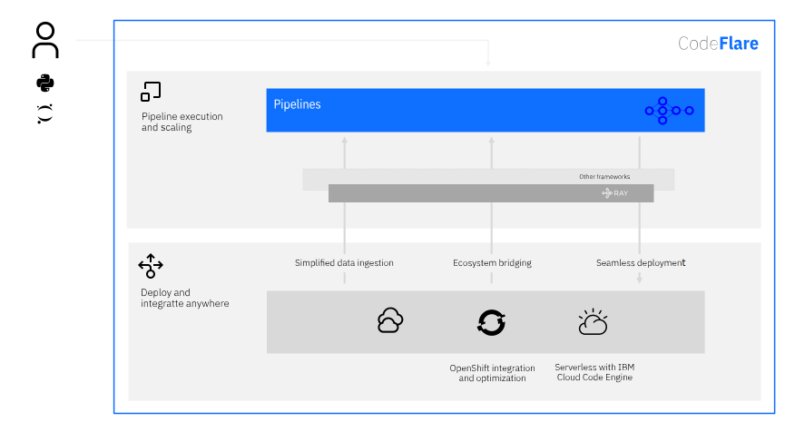

<!--

Copyright 2021 IBM

Licensed under the Apache License, Version 2.0 (the "License");
you may not use this file except in compliance with the License.
You may obtain a copy of the License at

http://www.apache.org/licenses/LICENSE-2.0

Unless required by applicable law or agreed to in writing, software
distributed under the License is distributed on an "AS IS" BASIS,
WITHOUT WARRANTIES OR CONDITIONS OF ANY KIND, either express or implied.
See the License for the specific language governing permissions and
limitations under the License.

-->

## Overview

CodeFlare's main features are: 

* **Pipeline execution and scaling**:
CodeFlare Pipelines faciltates the definition and parallel execution of pipelines. It unifies pipeline workflows across multiple frameworks while providing nearly optimal scale-out parallelism on pipelined computations.

* **Deploy and integrate anywhere**: 
CodeFlare simplifies deployment and integration by enabling a serverless user experience with the integration with Red Hat OpenShift and IBM Cloud Code Engine and providing adapters and connectors to make it simple to load data and connect to data services.

